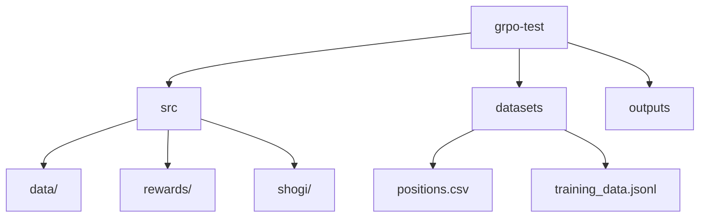

# GRPO Shogi Test

将棋の形勢判断をGRPO（Guided Reward Preference Optimization）を用いて学習するプロジェクト。Qwen2.5-3Bをベースモデルとして使用し、LoRAによる効率的な学習を実現。

## プロジェクト構造



## 必要要件

- Python >= 3.12
- CUDA 12.6
- GPU: RTX3090 or later
- OS: Windows11 & Ubuntu 24.04 (WSL2)

## 主要コンポーネント

1. データ生成 (make_data.py)
   - 学習用データの生成
   - YaneuraOuエンジンを使用した形勢評価

2. モデル学習 (main.py)
   - GRPOによる学習
   - wandbによる実験管理
   - LoRA適用による効率的な学習

3. 評価システム (src/rewards/)
   - 複数の報酬関数による評価
   - 形式と内容の両面での評価

## セットアップと実行

1. 環境構築
```bash
git clone https://github.com/Azuma413/grpo_test.git
# uvがインストールされていなければ
pip install uv
cd grpo_test
uv sync
```
2. やねうら王のインストール\
[こちらのページ](https://github.com/yaneurao/YaneuraOu/wiki/%E3%82%84%E3%81%AD%E3%81%86%E3%82%89%E7%8E%8B%E3%81%AE%E3%82%A4%E3%83%B3%E3%82%B9%E3%83%88%E3%83%BC%E3%83%AB%E6%89%8B%E9%A0%86)を参照して，Windowsにやねうら王をインストールしてください．
3. データセットの生成
```bash
uv run make_data.py
```
4. 学習の実行
```bash
uv run main.py
```
5. 推論の実行
```bash
uv run inference.py
```

## 参考資料

- [WSL2でunslothのGPROトレーニングを試してみる](https://note.com/ngc_shj/n/nadc7d41aa970?sub_rt=share_sb)
- [phi-4のGRPOやるipynb](https://colab.research.google.com/github/unslothai/notebooks/blob/main/nb/Phi_4_(14B)-GRPO.ipynb)